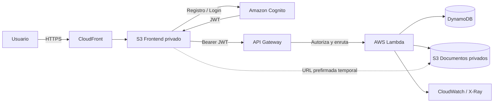
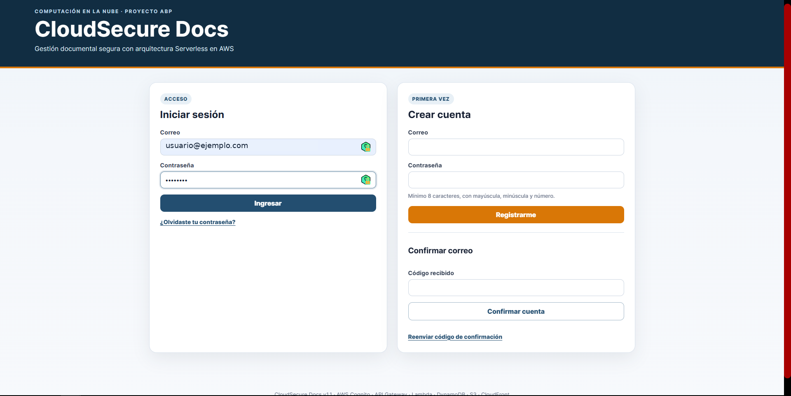
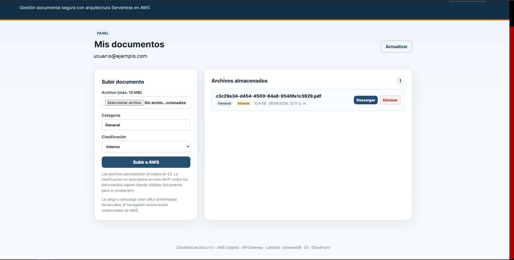
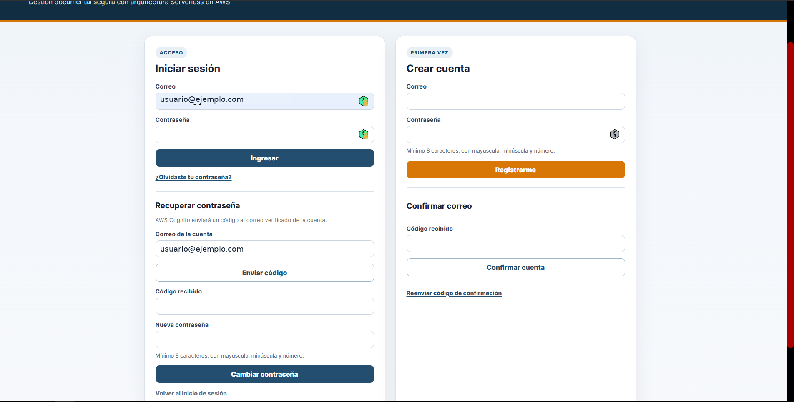
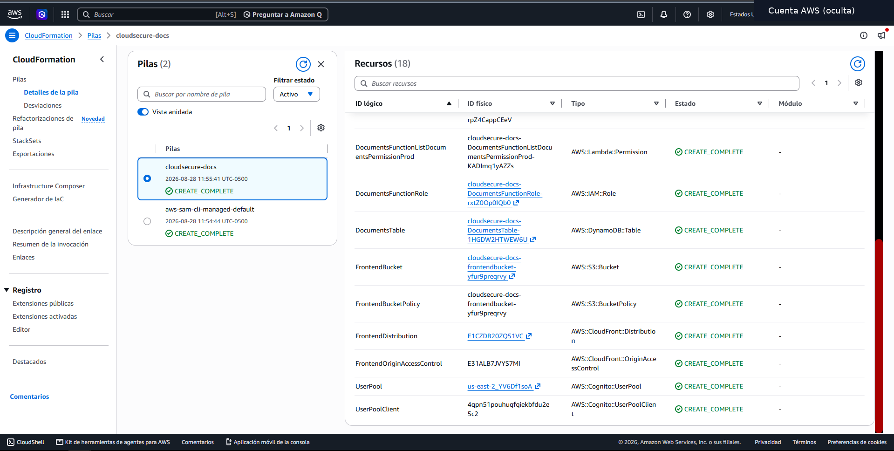
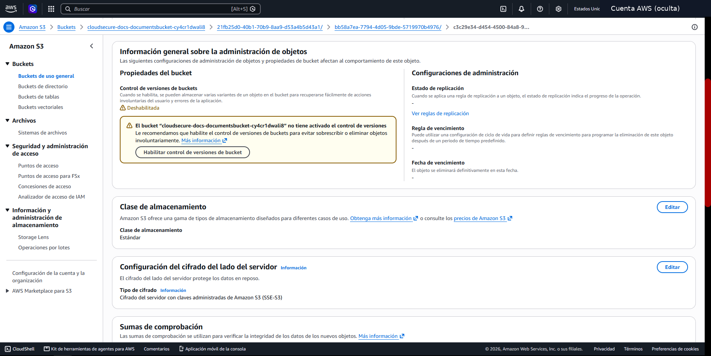
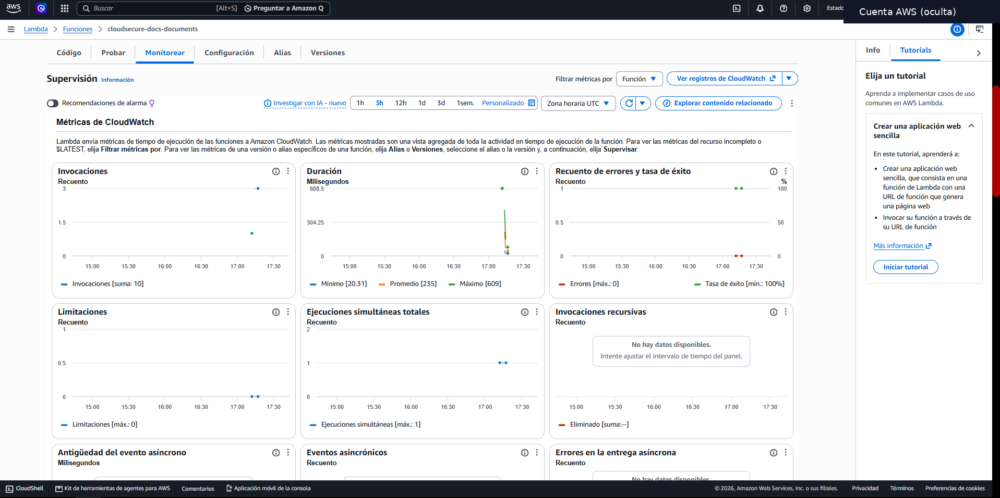
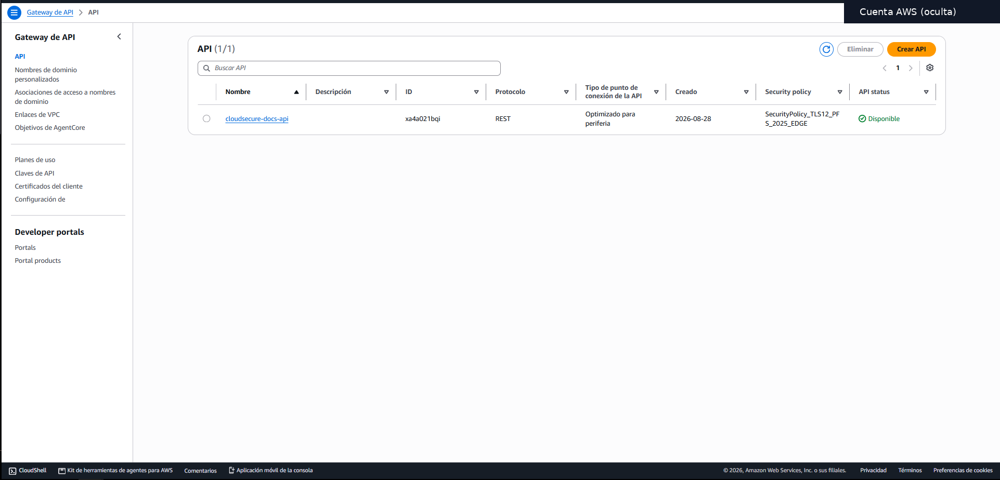

# CloudSecure Docs

[](https://github.com/TCardoR/cloudsecure-docs/actions/workflows/ci.yml)

**Versión 1.1 final del MVP académico**

CloudSecure Docs es un MVP de **gestión documental segura con arquitectura Serverless en AWS**.  
La solución permite registrar usuarios, autenticarlos, almacenar documentos de forma privada, consultar sus metadatos, descargar archivos mediante URLs prefirmadas y eliminarlos, aplicando controles básicos de seguridad, observabilidad e infraestructura como código.

---

## 1. Planteamiento del problema

Una institución académica necesita administrar documentos en la nube sin depender de un servidor tradicional y sin exponer archivos, credenciales o datos sensibles.

Una implementación básica que publique directamente un bucket o que gestione credenciales desde el navegador incrementaría el riesgo de accesos no autorizados, filtración de información y configuraciones inseguras.

Por ello, el proyecto busca demostrar una alternativa pequeña pero funcional basada en servicios administrados de AWS, en la que:

- los usuarios se autentican antes de acceder a la aplicación;
- cada usuario consulta únicamente sus propios documentos;
- los archivos permanecen privados;
- las cargas y descargas se realizan mediante URLs temporales;
- la infraestructura puede reproducirse desde código;
- las operaciones principales pueden observarse y probarse.

### Pregunta problema

> **¿Cómo diseñar e implementar una solución de gestión documental en la nube que permita autenticar usuarios, almacenar archivos de forma privada y controlar el acceso a los documentos, utilizando una arquitectura Serverless en AWS que sea reproducible, verificable y de bajo mantenimiento operativo?**

---

## 2. Objetivos

### Objetivo general

**Diseñar, implementar y validar antes del cierre de la primera entrega del curso un MVP funcional de gestión documental segura en AWS, utilizando arquitectura Serverless, autenticación con Amazon Cognito, almacenamiento privado en Amazon S3, metadatos en DynamoDB, una API protegida mediante API Gateway y Lambda, infraestructura como código con AWS SAM/CloudFormation y pruebas automatizadas mediante GitHub Actions.**

### Objetivos específicos

1. Implementar registro, confirmación, inicio de sesión, cierre de sesión y recuperación de contraseña mediante Amazon Cognito.
2. Desarrollar una API REST protegida que permita listar, cargar, descargar y eliminar documentos.
3. Mantener los archivos privados en Amazon S3 y permitir acceso temporal mediante URLs prefirmadas.
4. Almacenar los metadatos de los documentos en Amazon DynamoDB y separar los registros por usuario autenticado.
5. Aplicar controles básicos de seguridad: HTTPS, TLS moderno, bloqueo de acceso público, cifrado en reposo, CORS restringido e IAM de mínimo privilegio.
6. Definir la infraestructura mediante AWS SAM/CloudFormation para permitir despliegues reproducibles.
7. Incorporar observabilidad mediante Amazon CloudWatch y AWS X-Ray.
8. Validar el código y la infraestructura mediante pruebas unitarias, pruebas funcionales y un pipeline de integración continua en GitHub Actions.

---

## 3. Justificación tecnológica

La solución utiliza servicios Serverless y administrados porque permiten concentrar el esfuerzo en la lógica de la aplicación sin administrar servidores virtuales permanentemente.

| Decisión | Justificación |
|---|---|
| **Amazon Cognito** | Evita implementar un sistema propio de contraseñas y permite registro, confirmación, autenticación y recuperación de cuenta. |
| **Amazon API Gateway** | Expone una API REST administrada y permite validar tokens de Cognito antes de invocar el backend. |
| **AWS Lambda** | Ejecuta la lógica del backend bajo demanda sin mantener servidores dedicados. |
| **Amazon DynamoDB** | Permite almacenar metadatos con baja administración y separar documentos mediante claves `ownerId` y `documentId`. |
| **Amazon S3** | Es apropiado para almacenar archivos, mantenerlos privados, cifrarlos y utilizar URLs prefirmadas. |
| **Amazon CloudFront** | Permite servir el frontend privado desde S3 mediante HTTPS sin hacer público el bucket. |
| **AWS IAM** | Limita los permisos de Lambda a los recursos necesarios. |
| **CloudWatch / X-Ray** | Aporta métricas, logs y trazabilidad para validar el comportamiento de la solución. |
| **AWS SAM / CloudFormation** | Permite definir y reproducir la infraestructura mediante código. |
| **GitHub Actions** | Automatiza pruebas, validación del template y construcción del proyecto. |

La arquitectura prioriza **seguridad, bajo mantenimiento operativo, reproducibilidad y escalabilidad bajo demanda**, manteniendo un alcance apropiado para un MVP académico.

---

## 4. Metodología de trabajo

El proyecto se desarrolló mediante un ciclo incremental de tres etapas:

### 4.1 Diagnosticar y analizar

- Identificación del problema de gestión documental.
- Definición de los riesgos principales: exposición de archivos, credenciales y acceso no autorizado.
- Selección de servicios AWS administrados.
- Definición del alcance del MVP.

### 4.2 Diseñar e implementar

- Diseño de la arquitectura Serverless.
- Desarrollo del frontend y backend.
- Definición de recursos con AWS SAM/CloudFormation.
- Configuración de autenticación, almacenamiento, API, observabilidad y seguridad.
- Automatización del despliegue mediante PowerShell.

### 4.3 Evaluar y validar

- Pruebas unitarias del backend.
- Pruebas funcionales de registro, login, carga, listado, descarga, eliminación y recuperación de contraseña.
- Inspección de recursos creados en AWS.
- Revisión de métricas y logs en CloudWatch/X-Ray.
- Ejecución del pipeline CI en GitHub Actions.
- Mejora incremental de la versión 1.0 a la versión 1.1.

El ciclo aplicado fue:

```text
Diseñar
   ↓
Implementar
   ↓
Desplegar
   ↓
Probar
   ↓
Observar
   ↓
Mejorar
   ↓
Volver a desplegar
   ↓
Validar
```

---

## 5. Funcionalidades

- Registro de usuarios con correo electrónico.
- Confirmación de cuenta mediante código enviado por Amazon Cognito.
- Inicio y cierre de sesión.
- Recuperación de contraseña desde el frontend.
- Reenvío del código de confirmación.
- Carga de archivos de hasta 10 MB.
- Categorías de documentos.
- Clasificación `PUBLIC`, `INTERNAL` y `CONFIDENTIAL`.
- Listado de documentos del usuario autenticado.
- Descarga mediante URL prefirmada temporal.
- Eliminación de documentos.
- Almacenamiento privado y cifrado en S3.
- Metadatos en DynamoDB.
- API protegida con Cognito User Pool Authorizer.
- Logs, métricas y tracing mediante CloudWatch y AWS X-Ray.
- Retención administrada de logs durante 14 días.
- Frontend privado en S3 servido por CloudFront mediante HTTPS.
- API Gateway con política TLS moderna (`SecurityPolicy_TLS12_PFS_2025_EDGE`) y modo `STRICT`.
- CORS restringido al dominio CloudFront generado por el stack.
- Infraestructura como código con AWS SAM/CloudFormation.
- Pruebas unitarias e integración continua con GitHub Actions.

> **Importante:** la clasificación `PUBLIC`, `INTERNAL` y `CONFIDENTIAL` es descriptiva en esta versión del MVP. Todos los documentos permanecen privados y visibles únicamente para su propietario.

---

## 6. Arquitectura



### Flujo general

1. El usuario accede al frontend mediante CloudFront.
2. El frontend se comunica con Cognito para registro o autenticación.
3. Cognito entrega un JWT al frontend.
4. El frontend envía el JWT como `Bearer Token` a API Gateway.
5. API Gateway valida el token antes de invocar Lambda.
6. Lambda ejecuta la lógica de negocio.
7. DynamoDB almacena los metadatos.
8. S3 almacena los archivos físicos.
9. CloudWatch y X-Ray permiten observar el backend.

Más detalle en [`docs/architecture.md`](docs/architecture.md).

---

## 7. Servicios AWS

| Servicio | Uso |
|---|---|
| Amazon Cognito | Registro, confirmación, autenticación y recuperación de contraseña |
| Amazon API Gateway | API REST protegida |
| AWS Lambda | Lógica del backend |
| Amazon DynamoDB | Metadatos de documentos |
| Amazon S3 | Archivos privados y frontend |
| Amazon CloudFront | Distribución HTTPS del frontend |
| AWS IAM | Permisos de mínimo privilegio |
| Amazon CloudWatch | Logs y métricas |
| AWS X-Ray | Trazabilidad |
| AWS SAM / CloudFormation | Infraestructura como código |

---

## 8. Estructura del repositorio

```text
cloudsecure-docs/
├── backend/
│   ├── src/
│   │   ├── app.js
│   │   └── validation.js
│   ├── test/
│   ├── package.json
│   └── package-lock.json
├── frontend/
│   ├── index.html
│   ├── styles.css
│   ├── app.js
│   └── config.example.js
├── docs/
│   ├── architecture.md
│   └── screenshots/
├── infrastructure/
├── presentation/
├── scripts/
│   ├── deploy.ps1
│   ├── deploy-frontend.ps1
│   └── destroy.ps1
├── .github/
│   └── workflows/
│       └── ci.yml
├── template.yaml
├── CHANGELOG.md
├── LICENSE
└── README.md
```

---

## 9. Requisitos

Antes de desplegar se requiere:

1. Una cuenta de AWS.
2. AWS CLI v2.
3. AWS SAM CLI.
4. Node.js 22.
5. Git.
6. PowerShell 7 o Windows PowerShell.

Comprueba la región:

```powershell
aws configure get region
```

Comprueba la sesión:

```powershell
aws sts get-caller-identity
```

Si la sesión temporal expiró:

```powershell
aws login --region us-east-2
```

Región utilizada durante el desarrollo:

```text
us-east-2
```

---

## 10. Instalación local

El repositorio incluye `backend/package-lock.json`. Para instalar exactamente las dependencias registradas:

```powershell
cd backend
npm ci
npm test
cd ..
```

---

## 11. Despliegue completo

Desde la raíz del repositorio:

```powershell
.\scripts\deploy.ps1 -StackName cloudsecure-docs -Region us-east-2
```

El script realiza:

1. Verificación de credenciales AWS.
2. `sam build`.
3. `sam deploy`.
4. Lectura de outputs de CloudFormation.
5. Generación de `frontend/config.js`.
6. Carga del frontend a S3.
7. Invalidación de CloudFront.
8. Presentación de la URL HTTPS final.

También puede realizarse el despliegue manual:

```powershell
sam build --template-file template.yaml
sam deploy --guided
```

Después:

```powershell
.\scripts\deploy-frontend.ps1 -StackName cloudsecure-docs -Region us-east-2
```

---

## 12. Actualización segura v1.0 → v1.1

La versión 1.1 incorporó mejoras de seguridad y experiencia de usuario.

En una pila existente, la actualización de API Gateway puede realizarse primero con:

```powershell
.\scripts\deploy.ps1 `
    -StackName cloudsecure-docs `
    -Region us-east-2 `
    -ApiEndpointAccessMode BASIC
```

Después de validar que registro, login, listado, carga, descarga y eliminación continúan funcionando:

```powershell
.\scripts\deploy.ps1 `
    -StackName cloudsecure-docs `
    -Region us-east-2 `
    -ApiEndpointAccessMode STRICT
```

Para instalaciones nuevas, `STRICT` es el valor predeterminado.

La actualización realizada mediante CloudFormation preservó los usuarios de Cognito y los documentos existentes.

---

## 13. Endpoints

Todos los endpoints requieren un token válido de Cognito.

| Método | Ruta | Acción |
|---|---|---|
| GET | `/documents` | Lista los documentos propios |
| POST | `/documents/upload-url` | Crea metadatos y una URL temporal de carga |
| POST | `/documents/{documentId}/complete` | Marca la carga como terminada |
| GET | `/documents/{documentId}/download` | Crea una URL temporal de descarga |
| DELETE | `/documents/{documentId}` | Elimina archivo y metadatos |

### Ejemplo de carga

```json
{
  "filename": "informe.pdf",
  "contentType": "application/pdf",
  "size": 150000,
  "category": "Financiero",
  "classification": "CONFIDENTIAL"
}
```

---

## 14. Seguridad implementada

### Autenticación

Amazon Cognito controla:

- registro;
- confirmación;
- inicio de sesión;
- recuperación de contraseña;
- reenvío de códigos.

Las contraseñas no se almacenan en el código, S3 ni DynamoDB.

### Autorización

API Gateway utiliza Cognito como authorizer.

Una solicitud protegida sigue este flujo:

```text
Frontend
   ↓ JWT
API Gateway
   ↓ validación
Lambda
```

Una petición sin un JWT válido no debe llegar a la lógica protegida de Lambda.

### Aislamiento por usuario

Lambda obtiene el `sub` del JWT y lo utiliza como `ownerId`.

DynamoDB utiliza:

```text
Partition Key: ownerId
Sort Key: documentId
```

Esto permite consultar un documento utilizando simultáneamente el usuario autenticado y el identificador del documento.

### Almacenamiento privado

Los buckets S3 tienen bloqueo de acceso público.

El navegador no necesita credenciales AWS para cargar o descargar archivos.

### URLs prefirmadas

- Carga: 5 minutos.
- Descarga: 2 minutos.

### Cifrado en reposo

El bucket de documentos utiliza:

```text
SSE-S3 / AES-256
```

DynamoDB también tiene cifrado habilitado.

### Transporte

- CloudFront redirige HTTP → HTTPS.
- API Gateway utiliza una política TLS moderna.
- Modo de acceso de la API: `STRICT`.

### CORS

El origen permitido está restringido al dominio CloudFront generado por la infraestructura.

### IAM

Lambda recibe permisos CRUD limitados a:

- la tabla DynamoDB del proyecto;
- el bucket S3 de documentos.

No utiliza `AdministratorAccess`.

### Cabeceras de seguridad

CloudFront utiliza una política administrada de cabeceras de seguridad.

### Logs y observabilidad

- Logs estructurados en JSON.
- Retención de 14 días.
- Métricas de Lambda en CloudWatch.
- Tracing activo con AWS X-Ray.

---

## 15. Pruebas y validación

### Pruebas unitarias

Ejecutar:

```powershell
cd backend
npm ci
npm test
```

Casos automatizados:

- Sanitización del nombre del archivo.
- Validación de una carga correcta.
- Rechazo de archivos superiores a 10 MB.

Resultado validado durante el proyecto:

```text
3 tests
3 passed
0 failed
```

### Pruebas funcionales realizadas

Se verificó correctamente:

- creación de cuenta;
- confirmación por correo;
- inicio de sesión;
- cierre de sesión;
- recuperación de contraseña;
- cambio de contraseña;
- listado de documentos;
- persistencia de documentos después de actualizar la infraestructura;
- carga de documentos;
- descarga mediante URL prefirmada;
- eliminación de documentos.

### Validación en AWS

Se inspeccionaron:

- recursos de CloudFormation;
- usuario confirmado en Cognito;
- metadatos en DynamoDB;
- objetos privados en S3;
- cifrado SSE-S3;
- función Lambda;
- permisos IAM;
- rutas de API Gateway;
- política TLS final;
- CloudFront;
- métricas de CloudWatch;
- trazas de AWS X-Ray.

---

## 16. Integración continua

El workflow [`CI`](.github/workflows/ci.yml) se ejecuta automáticamente en:

- `push` a `main`;
- pull requests.

El pipeline valida:

1. Checkout del repositorio.
2. Configuración de Node.js 22.
3. Instalación de dependencias del backend.
4. Ejecución de pruebas unitarias.
5. Instalación de AWS SAM CLI.
6. `sam validate --lint`.
7. `sam build`.

El estado actual puede comprobarse mediante el badge de GitHub Actions al inicio de este documento.

> Para máxima reproducibilidad se recomienda que la instalación del pipeline utilice `npm ci`, aprovechando el `package-lock.json` incluido en el repositorio.

---

## 17. Costos y control de consumo

La arquitectura busca reducir infraestructura ociosa mediante servicios administrados y de pago por uso.

### Escenario académico de uso

El MVP está pensado para un volumen pequeño:

- pocos usuarios de prueba;
- menos de 1 GB de documentos;
- archivos individuales de máximo 10 MB;
- cientos o pocos miles de solicitudes durante las pruebas;
- una tabla DynamoDB en modo `PAY_PER_REQUEST`;
- una función Lambda;
- una API REST;
- una distribución CloudFront.

### Medidas de control

- Presupuesto de AWS configurado con alerta temprana.
- DynamoDB en modo bajo demanda.
- Lambda ejecutada únicamente ante solicitudes.
- Retención de logs limitada a 14 días.
- CloudFront configurado con `PriceClass_100`.
- Script de destrucción para retirar la infraestructura después de la actividad.

> El costo real depende de las tarifas vigentes, región, almacenamiento y tráfico. El proyecto evita publicar la URL de producción en el repositorio para reducir el riesgo de uso externo no controlado.

---

## 18. Evidencias

Las capturas incluidas en `docs/screenshots/` fueron sanitizadas antes de publicarse.

### Aplicación

| Acceso v1.1 | Dashboard y persistencia | Recuperación de contraseña |
|---|---|---|
|  |  |  |

### Infraestructura y seguridad

| CloudFormation | S3 cifrado | Lambda / CloudWatch | API Gateway TLS |
|---|---|---|---|
|  |  |  |  |

También se conserva:

```text
docs/screenshots/04-cloudformation-recursos-1.png
```

> No se deben publicar contraseñas, códigos de confirmación activos, credenciales AWS, identificadores de cuenta ni información personal innecesaria.

---

## 19. Eliminación de recursos

Para eliminar la infraestructura:

```powershell
.\scripts\destroy.ps1 -StackName cloudsecure-docs -Region us-east-2
```

El script:

1. obtiene los buckets creados por el stack;
2. vacía el bucket de documentos;
3. vacía el bucket del frontend;
4. ejecuta `sam delete`.

Después de eliminar el stack se recomienda revisar la consola de AWS y Billing/Cost Management.

---

## 20. Limitaciones del MVP

- Máximo de 10 MB por archivo.
- No existe administración de usuarios desde el frontend.
- La clasificación es descriptiva y todavía no modifica políticas de acceso.
- No incluye antivirus de archivos.
- No implementa intercambio de documentos entre usuarios.
- No incluye OCR.
- No incluye clasificación automática mediante IA.
- La versión actual no implementa una política de negocio diferente para cada nivel de clasificación.
- El flujo de finalización de carga confía en la confirmación enviada por el frontend; una versión productiva podría verificar la existencia del objeto en S3 antes de marcarlo como disponible.

---

## 21. Potencial de investigación y trabajo futuro

La arquitectura puede ampliarse hacia un sistema documental más completo mediante:

- OCR con Amazon Textract;
- clasificación automática de sensibilidad;
- detección de información sensible;
- escaneo antimalware antes de habilitar una carga;
- roles `Administrador`, `Usuario` y `Auditor`;
- auditoría detallada de acciones;
- búsqueda avanzada;
- versionado de documentos;
- políticas de acceso según clasificación;
- alertas automáticas de seguridad;
- análisis de comportamiento mediante servicios de monitoreo;
- evaluación comparativa de costos y rendimiento frente a una arquitectura tradicional basada en servidores.

### Línea de investigación propuesta

> **Evaluar cómo una arquitectura Serverless puede reducir la complejidad operativa de un sistema de gestión documental manteniendo controles de autenticación, autorización, cifrado, trazabilidad y escalabilidad bajo demanda.**

---

## 22. Presentación

La presentación final del proyecto se almacena dentro de:

```text
presentation/
```

Archivos recomendados para la entrega:

- [`CloudSecure_Docs_v1.1.pptx`](presentation/CloudSecure_Docs_v1.1.pptx)
- [`CloudSecure_Docs_v1.1.pdf`](presentation/CloudSecure_Docs_v1.1.pdf)

---

## 23. Resultado del proyecto

CloudSecure Docs demuestra que es posible construir un MVP de gestión documental pequeño pero funcional utilizando una arquitectura Serverless compuesta por servicios administrados de AWS.

La solución final integra:

```text
Frontend privado
       +
Autenticación
       +
API protegida
       +
Backend Serverless
       +
Almacenamiento privado
       +
Base de datos NoSQL
       +
Infraestructura como código
       +
Observabilidad
       +
Pruebas
       +
Integración continua
```

El proyecto fue desplegado, probado, actualizado de forma no destructiva y documentado para permitir su reproducción y evaluación.

---

## 24. Licencia

MIT.
