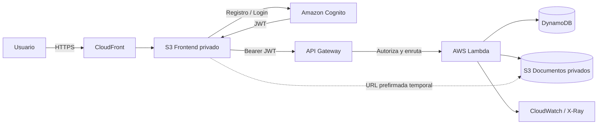

# CloudSecure Docs

[](https://github.com/TCardoR/cloudsecure-docs/actions/workflows/ci.yml)

**Versión 1.1 final del MVP académico.**

MVP académico de gestión documental segura construido con arquitectura **Serverless en AWS**.

El objetivo es demostrar una solución cloud pequeña pero funcional: registro e inicio de sesión, almacenamiento privado de documentos, consulta de metadata, descarga y eliminación, todo protegido por autenticación y permisos de mínimo privilegio.

## Funcionalidades

- Registro de usuarios con correo electrónico.
- Confirmación de cuenta mediante código enviado por Amazon Cognito.
- Inicio y cierre de sesión.
- Recuperación de contraseña desde el propio frontend mediante código de Cognito.
- Reenvío del código de confirmación de cuenta.
- Carga de archivos de hasta 10 MB.
- Categorías de documentos.
- Clasificación `PUBLIC`, `INTERNAL` y `CONFIDENTIAL`.
- Listado de documentos del usuario autenticado.
- Descarga mediante URL prefirmada temporal.
- Eliminación de documentos.
- Bucket S3 privado y cifrado.
- Metadata en DynamoDB.
- API protegida con Cognito User Pool Authorizer.
- Logs/tracing mediante CloudWatch y AWS X-Ray.
- Retención administrada de logs durante 14 días.
- Frontend privado en S3 servido por CloudFront mediante HTTPS y cabeceras de seguridad administradas.
- API Gateway con política TLS moderna (`SecurityPolicy_TLS12_PFS_2025_EDGE`) y modo `STRICT`.
- CORS restringido al dominio CloudFront generado por el stack.
- Infraestructura como código con AWS SAM/CloudFormation.
- Pruebas unitarias y CI con GitHub Actions.

## Arquitectura



El frontend obtiene el token JWT desde Cognito y lo envía a API Gateway en las solicitudes protegidas. API Gateway valida el token antes de permitir que la petición llegue a Lambda.

Más detalle en [`docs/architecture.md`](docs/architecture.md).

## Servicios AWS

| Servicio | Uso |
|---|---|
| Amazon Cognito | Registro, confirmación, inicio de sesión y recuperación de contraseña |
| API Gateway | API REST protegida |
| AWS Lambda | Lógica del backend |
| Amazon DynamoDB | Metadata de documentos |
| Amazon S3 | Archivos privados y frontend |
| Amazon CloudFront | Hosting HTTPS del frontend |
| AWS IAM | Permisos de mínimo privilegio para Lambda |
| CloudWatch / X-Ray | Logs, métricas y trazabilidad |
| AWS SAM / CloudFormation | Infraestructura como código |

## Estructura

```text
cloudsecure-docs/
├── backend/
│   ├── src/
│   │   ├── app.js
│   │   └── validation.js
│   ├── test/
│   ├── package.json
│   └── package-lock.json
├── frontend/
│   ├── index.html
│   ├── styles.css
│   ├── app.js
│   └── config.example.js
├── docs/
│   ├── architecture.md
│   └── screenshots/
├── presentation/
├── scripts/
│   ├── deploy.ps1
│   ├── deploy-frontend.ps1
│   └── destroy.ps1
├── .github/workflows/ci.yml
├── template.yaml
└── README.md
```

## Requisitos

Antes de desplegar debes tener:

1. Una cuenta de AWS.
2. AWS CLI v2 autenticado con `aws login` y región predeterminada `us-east-2`.
3. AWS SAM CLI.
4. Node.js 22 para ejecutar pruebas localmente.
5. PowerShell 7 o Windows PowerShell para los scripts incluidos.

Comprueba la región y la sesión antes de desplegar:

```powershell
aws configure get region
aws sts get-caller-identity
```

Si la sesión temporal expiró, vuelve a autenticarte con:

```powershell
aws login --region us-east-2
```

## Instalación local de dependencias

El repositorio incluye `backend/package-lock.json`, por lo que para reproducir exactamente las dependencias validadas se recomienda usar `npm ci`:

```powershell
cd backend
npm ci
npm test
cd ..
```

`npm ci` instala las versiones fijadas en `package-lock.json` sin modificar el lockfile, lo que mejora la reproducibilidad.

## Despliegue completo

Desde la raíz del repositorio:

```powershell
.\scripts\deploy.ps1 -StackName cloudsecure-docs -Region us-east-2
```

El script realiza:

1. Verificación de credenciales AWS.
2. `sam build`.
3. `sam deploy`.
4. Lectura de outputs de CloudFormation.
5. Generación de `frontend/config.js`.
6. Carga del frontend a S3.
7. Invalidación de CloudFront.
8. Impresión de la URL HTTPS final.

También puedes hacerlo manualmente:

```powershell
sam build --template-file template.yaml
sam deploy --guided
```

Después configura y publica el frontend:

```powershell
.\scripts\deploy-frontend.ps1 -StackName cloudsecure-docs -Region us-east-2
```

### Migración segura de la política TLS en una pila existente

Si vienes de la versión 1.0, la API puede usar una política TLS heredada. La actualización 1.1 puede realizarse en dos pasos: primero con `EndpointAccessMode=BASIC`, validando el tráfico, y después con `STRICT`.

```powershell
.\scripts\deploy.ps1 -StackName cloudsecure-docs -Region us-east-2 -ApiEndpointAccessMode BASIC
```

Prueba registro/login, listado, carga, descarga y eliminación. Si todo está correcto, endurece el modo de acceso:

```powershell
.\scripts\deploy.ps1 -StackName cloudsecure-docs -Region us-east-2 -ApiEndpointAccessMode STRICT
```

Para instalaciones nuevas puede utilizarse directamente el valor predeterminado `STRICT`.

## Primera prueba funcional

1. Abre la URL `FrontendUrl` mostrada al terminar el despliegue.
2. Registra un correo real.
3. Copia el código enviado por Cognito y confirma la cuenta.
4. Prueba opcionalmente “¿Olvidaste tu contraseña?” para validar el flujo de recuperación.
5. Inicia sesión.
6. Sube un PDF o imagen menor de 10 MB.
7. Comprueba que aparece en la lista.
8. Descárgalo.
9. Elimínalo.

## Endpoints

Todos los endpoints requieren un token válido de Cognito.

| Método | Ruta | Acción |
|---|---|---|
| GET | `/documents` | Lista los documentos propios |
| POST | `/documents/upload-url` | Crea metadata y URL temporal de carga |
| POST | `/documents/{documentId}/complete` | Marca la carga como terminada |
| GET | `/documents/{documentId}/download` | Crea URL temporal de descarga |
| DELETE | `/documents/{documentId}` | Elimina archivo y metadata |

### Ejemplo de solicitud para una carga

```json
{
  "filename": "informe.pdf",
  "contentType": "application/pdf",
  "size": 150000,
  "category": "Financiero",
  "classification": "CONFIDENTIAL"
}
```

## Seguridad implementada

### Autenticación

Cognito User Pool controla el registro, confirmación, inicio de sesión, reenvío de códigos y recuperación de contraseña. Las contraseñas nunca se almacenan en el código ni en DynamoDB.

### Autorización

El frontend obtiene un JWT válido desde Cognito y lo envía como token Bearer. API Gateway usa Cognito como authorizer y valida ese token antes de permitir que la solicitud llegue a Lambda.

### Aislamiento por usuario

Lambda toma el `sub` del JWT como `ownerId`. Las consultas de DynamoDB siempre utilizan ese valor, por lo que un usuario no puede pedir metadata de otro usuario simplemente cambiando el `documentId`.

### Almacenamiento

Los dos buckets tienen bloqueo de acceso público. El bucket de documentos utiliza cifrado del lado del servidor. El CORS del bucket de documentos está restringido al dominio CloudFront del frontend.

### URLs temporales

- Carga: 5 minutos.
- Descarga: 2 minutos.

El navegador nunca recibe access keys ni secret keys de AWS.

### IAM

La función recibe políticas limitadas a operaciones CRUD sobre el bucket y la tabla creados por este stack. No usa `AdministratorAccess`.

### Transporte y cabeceras HTTP

API Gateway utiliza una política TLS moderna compatible con TLS 1.2/1.3 y Perfect Forward Secrecy. CloudFront fuerza redirección de HTTP a HTTPS y adjunta la política administrada `SecurityHeadersPolicy` para agregar cabeceras de seguridad.

### Logs

Lambda envía los nuevos registros a un grupo CloudWatch administrado por CloudFormation con retención de 14 días y formato JSON. El script de despliegue también aplica 14 días al grupo legado `/aws/lambda/...` si ya existía de una versión anterior.

## Pruebas

Ejecuta:

```powershell
cd backend
npm ci
npm test
```

Casos incluidos:

- Sanitización del nombre del archivo.
- Validación de una carga correcta.
- Rechazo de archivos superiores a 10 MB.

Para la presentación se recomienda añadir pruebas manuales de:

- Acceso a la API sin token → rechazado.
- Usuario A intentando consultar un ID perteneciente al usuario B → no encontrado para A.
- Carga, descarga y eliminación correcta.
- Capturas de CloudWatch mostrando invocaciones.

## Integración continua

El workflow [`CI`](.github/workflows/ci.yml) se ejecuta automáticamente en cada `push` a `main` y en los pull requests.

La validación automática incluye:

1. Checkout del repositorio.
2. Configuración de Node.js 22.
3. Instalación de dependencias del backend.
4. Ejecución de pruebas unitarias.
5. Instalación de AWS SAM CLI.
6. `sam validate --lint` sobre `template.yaml`.
7. `sam build` de la aplicación Serverless.

El badge ubicado al inicio de este README permite comprobar rápidamente el estado actual del workflow.

## Costos y control de costos

La arquitectura fue diseñada como un MVP de bajo consumo y orientada a pago por uso:

- **AWS Lambda:** se ejecuta solo cuando existen solicitudes; no hay un servidor dedicado encendido permanentemente.
- **DynamoDB:** el volumen del MVP es pequeño y el consumo depende de las operaciones realizadas.
- **Amazon S3:** cobra principalmente por almacenamiento y solicitudes; los archivos de prueba son pequeños.
- **CloudFront:** distribuye el frontend y su consumo depende del tráfico generado.
- **API Gateway:** cobra por solicitudes procesadas.
- **CloudWatch:** la retención de logs está limitada a 14 días para evitar acumulación innecesaria.

Durante el desarrollo se configuró un presupuesto de AWS con una alerta temprana para detectar consumo inesperado. Para una práctica académica se recomienda revisar periódicamente Billing/Cost Management y eliminar la infraestructura cuando ya no sea necesaria.

El proyecto incluye `scripts/destroy.ps1`, que vacía primero los buckets S3 y luego elimina el stack de CloudFormation para reducir el riesgo de dejar recursos activos por descuido.

> Los costos reales dependen de la región, el tráfico, el almacenamiento y las tarifas vigentes de AWS. Este repositorio no publica una URL de producción para evitar uso externo no controlado de los recursos desplegados.

## Evidencias para la actividad

Las capturas incluidas en `docs/screenshots/` fueron sanitizadas antes de prepararlas para un repositorio público: se sustituyó el correo de prueba y se ocultó el identificador de la cuenta AWS.

### Aplicación

| Acceso v1.1 | Dashboard y persistencia | Recuperación de contraseña |
|---|---|---|
|  |  |  |

### Infraestructura y seguridad

| CloudFormation | S3 cifrado | Lambda / CloudWatch | API Gateway TLS |
|---|---|---|---|
|  |  |  |  |

También se conserva una segunda captura del stack en `docs/screenshots/04-cloudformation-recursos-1.png`.

> No publiques capturas con códigos de confirmación, contraseñas, correos reales, identificadores de cuenta o credenciales.

## Eliminación de recursos

Para evitar mantener recursos que ya no necesitas:

```powershell
.\scripts\destroy.ps1 -StackName cloudsecure-docs -Region us-east-2
```

El script vacía primero los buckets y luego elimina el stack.

> Revisa siempre la consola de AWS después de las pruebas para confirmar qué recursos siguen activos y controlar costos.

## Limitaciones del MVP

- Máximo de 10 MB por archivo.
- No existe administración de usuarios desde el frontend.
- La clasificación se selecciona manualmente; todavía no cambia las políticas de acceso.
- No incluye OCR ni IA.
- No incluye antivirus de archivos.
- No implementa compartir documentos entre usuarios.

Estas limitaciones son intencionales para mantener el alcance apropiado para una primera entrega académica. La recuperación de contraseña sí está incluida desde la versión 1.1.

## Trabajo futuro

- Clasificación automática de sensibilidad con IA.
- OCR con Amazon Textract.
- Escaneo de malware antes de marcar archivos como disponibles.
- Roles Administrador/Usuario/Auditor.
- Auditoría de acciones de negocio.
- Alertas de seguridad.
- Políticas distintas según `PUBLIC`, `INTERNAL` y `CONFIDENTIAL`.

## Presentación

Guarda el `.pptx` y/o `.pdf` final dentro de `presentation/` antes de entregar el enlace del repositorio.

## Licencia

MIT.
