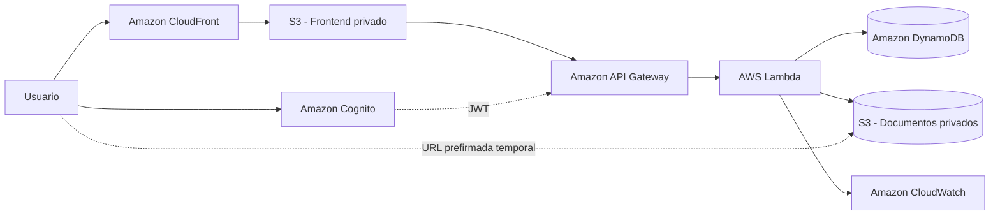

# Arquitectura de CloudSecure Docs

## Decisiones principales

- **Cognito** autentica a los usuarios y API Gateway valida el token antes de ejecutar Lambda.
- **Lambda** contiene la lógica de negocio y nunca expone credenciales de AWS al navegador.
- **S3 de documentos** permanece completamente privado; la aplicación utiliza URLs prefirmadas con expiración corta.
- **DynamoDB** conserva únicamente metadatos y usa `ownerId` como clave de partición para separar los documentos por usuario.
- **CloudFront + S3 privado** sirven el frontend mediante HTTPS sin publicar directamente el bucket.
- **CloudWatch/X-Ray** permiten obtener logs y trazabilidad para las evidencias del proyecto.

## Flujo de carga

1. El usuario se autentica con Cognito.
2. El frontend solicita `POST /documents/upload-url` enviando metadata del archivo.
3. API Gateway valida el JWT.
4. Lambda genera una URL prefirmada de S3 válida durante cinco minutos y registra el documento como `PENDING`.
5. El navegador carga el archivo directamente a S3.
6. El frontend llama `POST /documents/{id}/complete` y el registro pasa a `READY`.

## Flujo de descarga

1. El usuario solicita descargar un documento propio.
2. Lambda busca el documento usando simultáneamente `ownerId` y `documentId`.
3. Si existe y está `READY`, devuelve una URL prefirmada de lectura válida durante dos minutos.
4. El bucket nunca se hace público.

## Endurecimiento de la versión 1.1

- API Gateway usa `SecurityPolicy_TLS12_PFS_2025_EDGE` con `EndpointAccessMode: STRICT`, aceptando TLS moderno y suites con Perfect Forward Secrecy.
- CORS de API Gateway, respuestas de Lambda y S3 de documentos se restringe al dominio CloudFront creado por el stack.
- CloudFront fuerza HTTPS y utiliza la política administrada `SecurityHeadersPolicy`.
- Lambda escribe en el grupo `/<AppName>/lambda/documents`, administrado por CloudFormation con 14 días de retención y logs estructurados JSON.
- El frontend incorpora recuperación de contraseña (`ForgotPassword` + `ConfirmForgotPassword`) y reenvío del código de confirmación.
